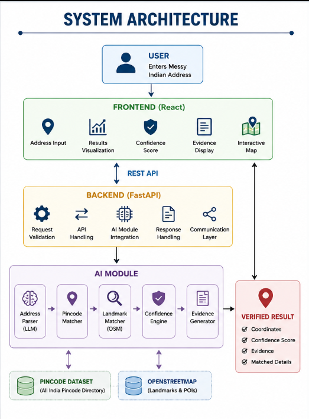
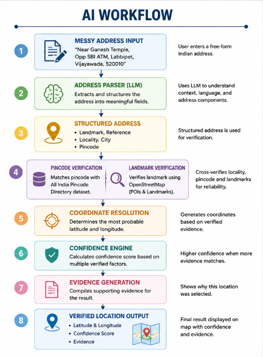

# PATA – AI-Powered Indian Address Parsing & Geocoding

## 🚀 Overview

PATA is an AI-powered address parsing and geocoding system designed
to convert messy, informal Indian addresses into accurately
geocoded locations.

Indian addresses often contain landmark-based directions,
informal colony names, abbreviations, incorrect pincodes,
Hinglish, transliterated text, and regional-language scripts.

PATA combines AI-based address parsing with pincode verification
and OpenStreetMap landmark verification to identify the most
reliable geographic location while providing a confidence score
and supporting evidence.

---

# 🎯 Problem Statement

Indian delivery partners handle a large number of deliveries every
day. Messy and informal addresses can lead to:

- Incorrect map locations
- Repeated phone calls to customers
- Time lost searching for landmarks
- Delivery delays
- Failed deliveries

Generic geocoders often struggle with addresses such as:

"Near Ganesh Temple, Opp SBI ATM, Labbipet, Vijayawada, 520010"

PATA addresses this problem by understanding the structure and
meaning of the address instead of relying only on the raw address
string.

---

# 💡 Our Solution

PATA processes an address through multiple verification stages:

1. Address parsing
2. Language/transliteration handling
3. Locality and pincode matching
4. Landmark verification using OpenStreetMap
5. Coordinate generation
6. Confidence scoring
7. Evidence generation
8. Final result displayed on a map

The system does not silently guess when the available evidence is
weak. Instead, it produces a confidence score and supporting evidence.

---

# 🏗️ System Architecture

The system consists of three major layers:

### Frontend

Provides:

- Address input
- Result visualization
- Confidence display
- Evidence display
- Interactive map

### Backend

Responsible for:

- API requests
- Request validation
- AI module integration
- Response handling
- Communication between frontend and AI

### AI Layer

Responsible for:

- Address parsing
- Landmark identification
- Pincode verification
- OpenStreetMap verification
- Confidence calculation
- Evidence generation

---

# 🤖 AI Workflow

The AI workflow follows:

Messy Address
      ↓
Address Parser
      ↓
Structured Address
      ↓
Pincode Verification
      ↓
Landmark Verification
      ↓
Coordinate Resolution
      ↓
Confidence Engine
      ↓
Evidence Generation
      ↓
Verified Location

---

Expected Output:

         AI ADDRESS PARSING & GEOCODING SYSTEM

📍 ORIGINAL ADDRESS
----------------------------------------------------------------------

Near Ganesh Temple
Opp SBI ATM
Labbipet
Vijayawada
520010

🌐 TRANSLATED ADDRESS
----------------------------------------------------------------------
Near Ganesh Temple
Opp SBI ATM
Labbipet
Vijayawada
520010

🧠 PARSED COMPONENTS
----------------------------------------------------------------------
House Number : Not Found
Street       : Not Found
Landmark     : Ganesh Temple
Reference    : Opp SBI ATM
Locality     : Labbipet
City         : Vijayawada
District     : Not Found
State        : Not Found
Pincode      : 520010

📌 GEOLOCATION
----------------------------------------------------------------------
Latitude     : 16.5054215
Longitude    : 80.6513258

🗺 GOOGLE MAPS
----------------------------------------------------------------------
https://www.google.com/maps?q=16.5054215,80.6513258

✅ CONFIDENCE SCORE
----------------------------------------------------------------------
70%

🔍 WHY THIS RESULT?
----------------------------------------------------------------------
✔ Landmark verified via OpenStreetMap
✔ Valid pincode

📄 EVIDENCE
----------------------------------------------------------------------
✔ Matched Landmark : Ganesh Temple
✔ Pincode 520010 verified
✔ District : NTR
✔ State : ANDHRA PRADESH

ADDRESS SUCCESSFULLY VERIFIED

